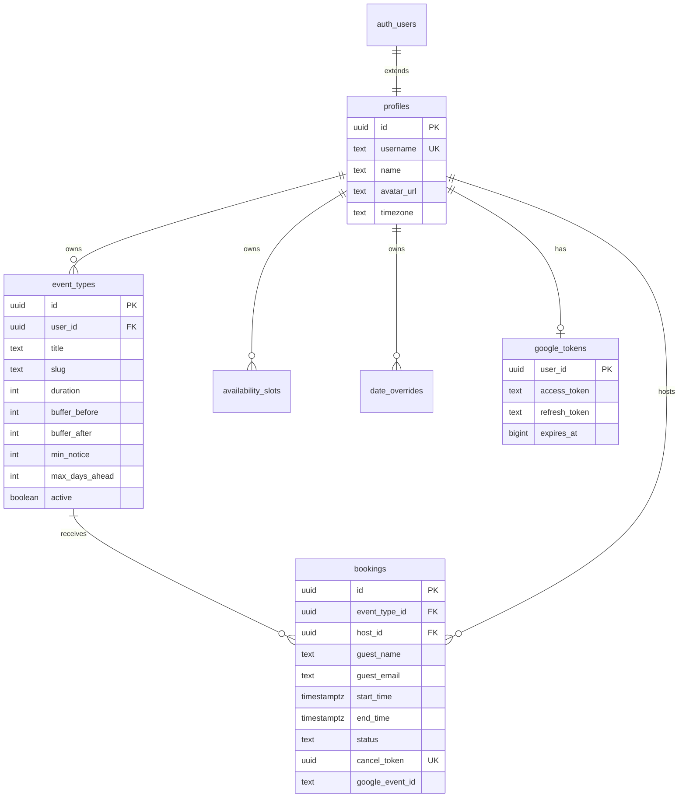

# Database

Postgres on Supabase. Schema defined in `supabase/migrations/001_initial.sql`.

## Entity relationship

## Tables

### `profiles`

Extends `auth.users`. Created automatically by trigger `handle_new_user()` on signup.

| Column | Notes |
|--------|-------|
| `username` | Unique; used in booking URL `/book/{username}/{slug}` |
| `timezone` | Host timezone for availability windows; default `America/New_York` |
| `name`, `avatar_url` | From OAuth metadata or email signup |

Onboarding (`ensureUserOnboarded`) sets `username` if still null after trigger.

### `event_types`

Bookable meeting templates per host.

| Column | Notes |
|--------|-------|
| `duration` | Meeting length in minutes |
| `buffer_before` / `buffer_after` | Padding around meetings |
| `min_notice` | Minimum minutes before a slot can be booked |
| `max_days_ahead` | How far ahead guests can book |
| `slug` | Unique per host; part of booking URL |
| `active` | Inactive types hidden from public |

### `availability_slots`

Weekly recurring windows. `day_of_week`: 0 = Sunday … 6 = Saturday.

Times stored as `HH:mm` strings in the **host's timezone**.

### `date_overrides`

Per-date exceptions (schema ready; UI not built in MVP). Can mark a date unavailable or set custom hours.

### `bookings`

| Column | Notes |
|--------|-------|
| `status` | `confirmed` or `cancelled` |
| `cancel_token` | UUID for guest cancellation without login |
| `google_event_id` | Set when Calendar connected at booking time |
| `timezone` | Guest's timezone at booking time |

### `google_tokens`

One row per host. Written via service role during Calendar OAuth callback. Never exposed to client.

## Triggers

| Trigger | Purpose |
|---------|---------|
| `handle_new_user` | Insert `profiles` row on `auth.users` insert |
| `set_updated_at` | Auto-update `updated_at` on profiles, event_types, bookings |

## Row Level Security (RLS)

All public tables have RLS enabled.

### Profiles

| Policy | Access |
|--------|--------|
| Users can view/update own profile | Host only (`auth.uid() = id`) |
| Public can view profiles with username | Anyone (for booking pages) |

### Event types

| Policy | Access |
|--------|--------|
| Users manage own event types | Host CRUD |
| Public can view active event types | Guests see active types only |

### Availability & date overrides

| Policy | Access |
|--------|--------|
| Users manage own rows | Host CRUD |
| Public can view | Guests need slots for booking page |

### Bookings

| Policy | Access |
|--------|--------|
| Hosts can view own bookings | `auth.uid() = host_id` |

**Note:** Guest booking insert uses **admin client** (no guest session). Cancellation uses admin client with `cancel_token` lookup.

### Google tokens

| Policy | Access |
|--------|--------|
| Users manage own google tokens | Host only |

Token reads/writes in Calendar API also go through admin client server-side.

## Migrations

Currently a single migration file. To apply:

1. Supabase Dashboard → SQL Editor
2. Paste contents of `supabase/migrations/001_initial.sql`
3. Run

For future changes, add numbered migration files and document them here.

## TypeScript types

Hand-maintained in `src/lib/supabase/types.ts`. Keep in sync when schema changes.

## Related

- [auth.md](./auth.md) — how `google_tokens` is populated
- [scheduling.md](./scheduling.md) — how availability and bookings feed slot calculation
