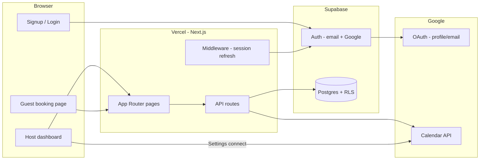

# Architecture Overview

## System diagram

## Layers

| Layer | Location | Role |
|-------|----------|------|
| **Pages** | `src/app/` | Server components, layouts, public booking UI |
| **Components** | `src/components/` | Client UI: auth forms, booking flow, dashboard |
| **API routes** | `src/app/api/` | JSON endpoints for dashboard and guest booking |
| **Domain logic** | `src/lib/scheduling/` | Slot calculation |
| **Integrations** | `src/lib/google-*.ts` | Calendar OAuth + API |
| **Data access** | `src/lib/supabase/` | Browser, server, and admin Supabase clients |
| **Auth helpers** | `src/lib/auth/` | Session, onboarding |
| **Schema** | `supabase/migrations/` | Tables, triggers, RLS policies |

## Supabase clients

Three clients — use the right one:

| Client | File | When |
|--------|------|------|
| **Browser** | `src/lib/supabase/client.ts` | Client components (auth forms, sign out) |
| **Server** | `src/lib/supabase/server.ts` | Server components, API routes with user session (RLS applies) |
| **Admin** | `src/lib/supabase/admin.ts` | Service role — guest booking, slot calc, onboarding, token storage |

**Rule:** Prefer server client + RLS for host-owned data. Admin client is used where there is no logged-in user (public booking) or where RLS would block required operations (insert booking as guest).

## Route map

### Public (no login)

| Route | Type |
|-------|------|
| `/` | Landing |
| `/signup`, `/login` | Auth |
| `/book/{username}/{slug}` | Guest booking |
| `/auth/callback` | Supabase OAuth callback |
| `/auth/callback/google-calendar` | Calendar OAuth callback |
| `GET /api/slots` | Available times for booking page |
| `POST /api/bookings` | Create booking (guest) |
| `DELETE /api/bookings?token=` | Cancel booking (guest token) |

### Protected (host session required)

| Route | Type |
|-------|------|
| `/dashboard/*` | Host UI |
| `/api/profile` | Profile read/update |
| `/api/event-types` | Event type CRUD |
| `/api/availability` | Weekly hours |
| `GET /api/bookings` | Host's bookings list |
| `/api/integrations/google/connect` | Calendar connect/disconnect |

Middleware (`src/middleware.ts`) refreshes Supabase session cookies on matched routes.

## Data flow: guest books a slot

1. Guest opens `/book/{username}/{slug}`
2. Client fetches `GET /api/slots?username=&slug=&timezone=`
3. Server loads host profile + event type, runs `getAvailableSlots()` (availability + bookings + Google busy)
4. Guest picks time, submits `POST /api/bookings`
5. Server validates slot still available (`isSlotAvailable`)
6. If host has Calendar connected → create Google event with Meet link
7. Insert row in `bookings`, return confirmation + cancel token

## Data flow: host signs up

1. Email: `supabase.auth.signUp()` → optional email confirm → `/auth/callback` or direct session
2. Google: `signInWithOAuth({ provider: 'google' })` → Supabase → `/auth/callback`
3. Callback runs `ensureUserOnboarded()` — username, default event type, availability
4. Dashboard layout also calls onboarding on first visit (covers email signup without callback)

## Deployment

- **Hosting:** Vercel (repo root — no subdirectory)
- **Database + Auth:** Supabase hosted Postgres
- **No local SQLite** — development can use remote Supabase project

See [development/setup.md](../development/setup.md) for configuration.

## Related docs

- [auth.md](./auth.md) — OAuth flows and scopes
- [database.md](./database.md) — Tables and RLS
- [scheduling.md](./scheduling.md) — Slot engine
- [api/routes.md](../api/routes.md) — HTTP API reference
